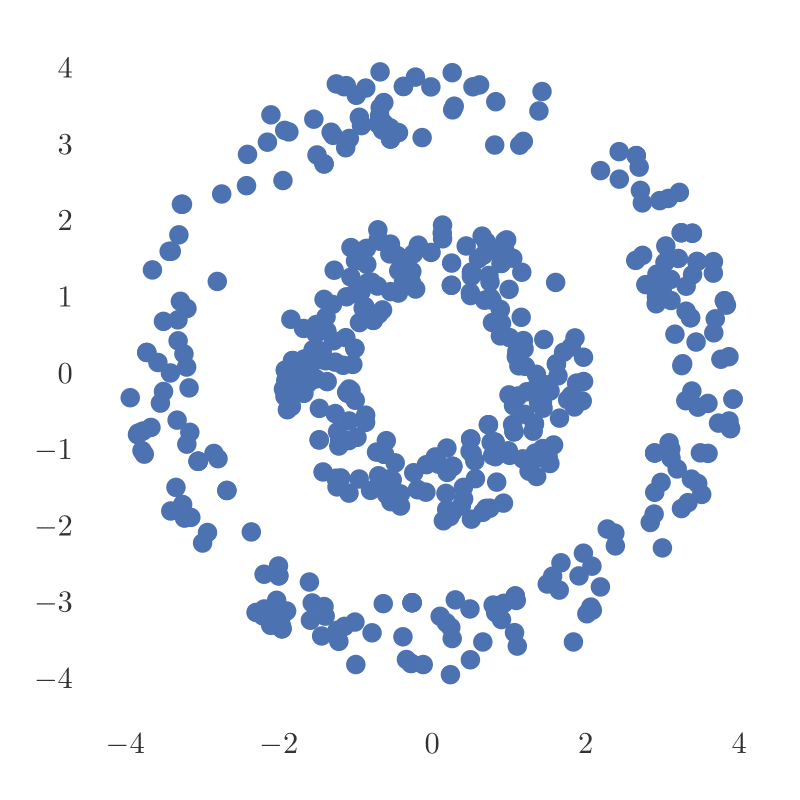
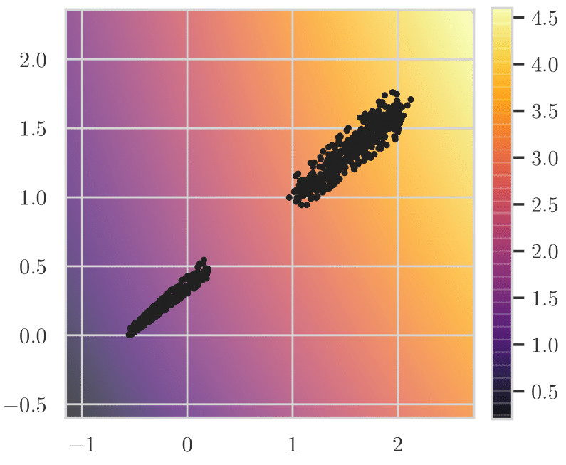
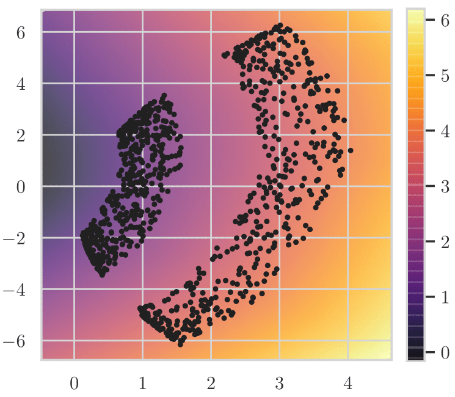

# model-augmented-mutual-information

This repository contains code related to the paper "Model-Augmented Conditional Mutual Information Estimation for Feature Selection," which appeared at the Conference on Uncertainty in Artificial Intelligence (UAI), 2020.

Link to paper: https://arxiv.org/abs/1911.04628

The code in this repository depends on ```pycit``` (https://github.com/syanga/pycit), which can be installed using pip:
```
pip install pycit
```


# Experiments

## 1. Improving the Performance of k-NN Mutual Information Estimator 

This experiment shows how a learned mapping can improve the performance of the k-NN mutual information (MI) estimator. We have a random variable X which is sampled uniformly on two concentric rings; a scatterplot of 500 samples is shown below:



Let Y be the magnitude of X plus noise. The goal is to estimate I(X;Y), the MI between X and Y. The samples of X are spread across two rings instead of just along a single axis, which makes k-NN MI estimation more difficult. Therefore, before using the k-NN estimator, we would like to learn a mapping of X that looks more like the mapping on the left, than on the right:




We learn this mapping with a regularization term that 


## 2. Conditional Independence Testing